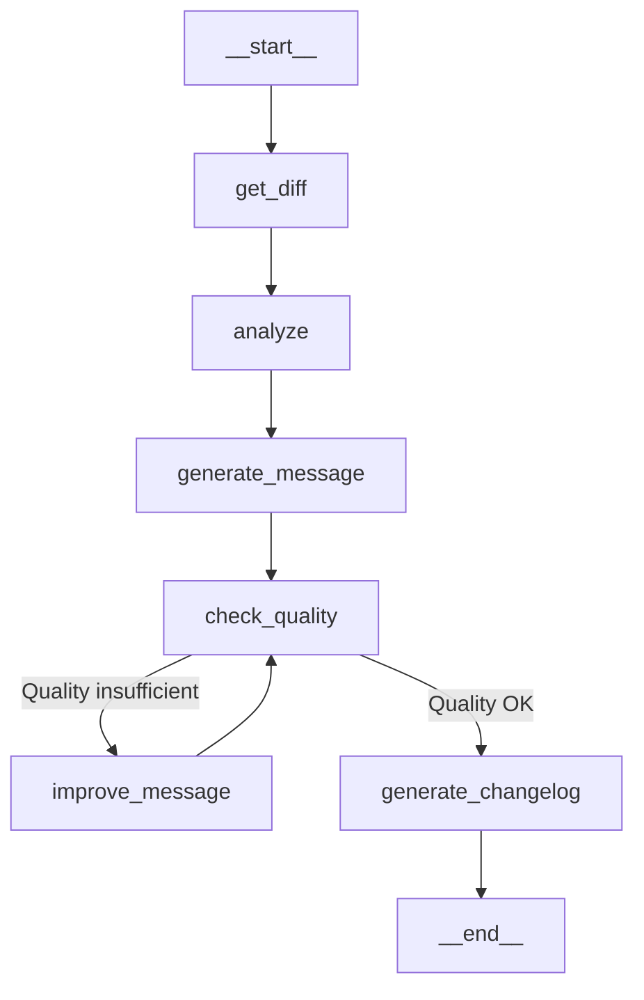

# GitSynth Domain Documentation

## CommitAgent - Intelligent Git Commit Assistant

The CommitAgent is the heart of GitSynth and controls the entire workflow for creating high-quality Git commits. It uses a directed graph to coordinate the various processing steps. Unfortunately, tools with Ollama don't work, so it's a Chain :(

### 🔄 Workflow Overview



### 📝 Workflow Steps in Detail

1. **Get Diff** (`get_diff`)
   - Reads staged changes from Git
   - Extracts differences between working directory and stage
   - Output: Raw Git diff as text

2. **Analyze** (`analyze`)
   - Analyzes changes in detail
   - Creates structured `GitDiffAnalysis`
   - Examines each changed file
   - Determines change type and purpose
   - Output: Detailed analysis structure

3. **Generate Message** (`generate_message`)
   - Creates a Conventional Commit message
   - Based on previous analysis
   - Follows strict formatting rules
   - Output: Formatted commit message

4. **Check Quality** (`check_quality`)
   - Checks commit message quality
   - Validates against Conventional Commits standard
   - Decides on further processing
   - Output: Quality assessment & next step

5. **Improve Message** (`improve_message`)
   - Improves commit message if needed
   - Only executed if quality is insufficient
   - Multiple improvement attempts possible
   - Output: Improved commit message

6. **Generate Changelog** (`generate_changelog`)
   - Creates a formatted changelog entry
   - Documents all important changes
   - Saves to CHANGELOG_AGENT.md
   - Output: Markdown-formatted changelog

### 🔧 Technical Components

#### CommitAgent Class
```python
class CommitAgent:
    """
    Main coordinator for the Git commit workflow
    - Creates and manages the workflow graph
    - Executes processing
    - Provides workflow visualization
    """
```

#### Important State Objects

1. **GitFileChange**
   - Detailed analysis of a file change
   - Contains Path, Change-Type, Lines Changed etc.

2. **GitDiffAnalysis**
   - Complete analysis of all changes
   - Contains Summary, Change-Type, Breaking Changes

3. **ConventionalCommit**
   - Structured commit message
   - Validated against Conventional Commits standard

4. **AgentState**
   - Current workflow state
   - Stores Messages, Attempts, Analyses etc.

### 🔍 Quality Assurance

The agent implements several quality assurance mechanisms:

- **Iterative Improvement**: Up to 5 attempts for message optimization
- **Conventional Commits**: Strict adherence to the standard
- **Breaking Changes**: Automatic detection and marking
- **Changelog Generation**: Automatic documentation of all changes

### 💾 Persistence

- Automatic changelog generation in CHANGELOG_AGENT.md
- Storage of all processing steps in state
- History of all improvement attempts

### 📝 Usage

```python
# Example of using CommitAgent
agent = CommitAgent()

# Execute workflow
result = agent.run(messages=[])

# Visualize workflow
agent.visualize_workflow()
```

### 📚 Technical Implementation Details

#### 🔍 Prompt-Engineering & LLM-Integration

##### Get Diff Implementation
```python
def get_git_diff(state: AgentState) -> AgentState:
    """
    Extrahiert Git Diff aus dem Staging-Bereich
    - Nutzt GitHandler für Git-Operationen
    - Speichert Diff im Message-Stream
    """
    try:
        git = GitHandler()
        diff = git.get_staged_diff()
        state["messages"].append(
            HumanMessage(content=f"Here are the staged changes:\n\n{diff}")
        )
        return state
    except GitHandlerError as e:
        state["messages"].append(
            AIMessage(content=f"Error getting git diff: {str(e)}")
        )
        return state
```

##### Analyze Implementation Details
Der Analyze-Schritt verwendet mehrere spezialisierte Funktionen:

1. **parse_git_diff**
```python
def parse_git_diff(diff_text: str) -> List[GitFileChange]:
    """
    Parst Git Diffs mit unidiff Library
    - Extrahiert Dateiänderungen
    - Analysiert Hunks
    - Berechnet Statistiken
    """
```

2. **Analyse-Prompt Template**
```text
Act as an expert software engineer. Analyze this specific file change and provide a purpose description:

File: {path}
Type: {change_type}
Lines: +{added} -{removed}

Content from diff:
{diff}

Provide a concise, technical purpose description that explains:
1. What exactly changed in this file
2. Why this change was made (based on code context)
3. How it fits into the overall changes
4. IMPORTANT: Use senior technical descriptions

Return your response as a JSON object with a 'purpose' field.
```

##### Message Generation Details

1. **Conventional Commit Prompt**
```text
Act as an expert software engineer. Generate a concise Conventional Commit message:

{analysis}

Note: This change is{breaking_note} a breaking change.
Detected possible scopes from paths: {scopes}

STRICT COMMIT RULES:
1. Format: <type>(<scope>): <imperative-verb> <what-and-why>
   - If breaking change: <type>(<scope>)!: <description>
   - Scope should be: {scopes}
   - MUST be under 50 characters total

2. Types: feat|fix|docs|refactor|test|chore|style|perf

3. Description MUST:
   - START with IMPERATIVE verb (add/implement/update/fix)
   - Don't capitalize the first letter
   - Be specific about WHAT is being changed
   - Be under 50 characters
   - Not end with period
   - Use imperative mood (NO: added/implemented/fixed)
```

#### 🔄 State Management

##### AgentState Details
```python
class AgentState(TypedDict):
    """
    Komplexer State für den Workflow
    """
    messages: Annotated[Sequence[BaseMessage], add_messages]
    attempts: int  # Zählt Verbesserungsversuche
    next: Literal["improve_message", "generate_changelog"]
    analysis: Optional[GitDiffAnalysis]  # Speichert Analyse
    final_message: Optional[str]  # Finale Commit Message
    message_history: List[Dict[str, Any]]  # Message-Verlauf
```

##### GitFileChange Details
```python
class GitFileChange(BaseModel):
    """
    Detaillierte Analyse einer Dateiänderung
    """
    path: str  # Dateipfad
    change_type: Literal[
        "NEW", "DELETED", "RENAMED", "MODE_CHANGED",
        "MODIFIED", "BINARY", "SUBMODULE", "CONFLICT"
    ]
    old_path: Optional[str] = None  # Bei Renames
    added_lines: int = 0  # Anzahl hinzugefügter Zeilen
    removed_lines: int = 0  # Anzahl entfernter Zeilen
    hunks: List[dict] = Field(default_factory=list)  # Code-Blöcke
    purpose: str = Field(description="Beschreibung der Änderung")
```

#### 🛠 Qualitätssicherung im Detail

##### Quality Check Implementation
```python
def check_quality(state: AgentState) -> AgentState:
    """
    Qualitätsprüfung der Commit Message
    """
    ollama_client = OllamaWrapper()
    message = state["messages"][-1].content
    
    prompt = """Act as a Conventional Commits expert. Check if this commit message is valid:

    Commit Message: {message}

    VALIDATION RULES:
    1. Format must be: <type>[optional_scope]: <description>
       - type: feat|fix|docs|refactor|test|chore|style|perf
       - scope: OPTIONAL, in parentheses
       - description: imperative, max 80 chars
       - first letter must be lowercase
    
    2. Breaking changes:
       - Add ! before : for breaking changes
       
    3. Common issues:
       - Wrong type
       - Past tense used
       - Too long (>200 chars)
       - Non-imperative mood
       - Capitalized first letter"""
```

#### 📊 Workflow-Visualisierung Details

##### Graph Creation
```python
def create_graph():
    """
    Workflow-Graph Setup
    """
    workflow = StateGraph(AgentState)
    
    # Nodes
    workflow.add_node("get_diff", get_git_diff)
    workflow.add_node("analyze", analyze_changes)
    workflow.add_node("generate_message", generate_commit_message)
    workflow.add_node("check_quality", check_quality)
    workflow.add_node("improve_message", improve_message)
    workflow.add_node("generate_changelog", generate_changelog)
    
    # Basis-Flow
    workflow.add_edge(START, "get_diff")
    workflow.add_edge("get_diff", "analyze")
    workflow.add_edge("analyze", "generate_message")
    workflow.add_edge("generate_message", "check_quality")
    
    # Conditional Edges
    workflow.add_conditional_edges(
        "check_quality",
        lambda x: x["next"],
        {
            "improve_message": "improve_message",
            "generate_changelog": "generate_changelog"
        }
    )
    
    return workflow
```

#### 🔧 Konfiguration & Anpassung

##### OllamaWrapper Konfiguration
```python
class OllamaWrapper:
    """
    LLM-Integration mit Ollama
    """
    def __init__(self):
        self.model = os.getenv("OLLAMA_MODEL", "llama3.2")
        self.temperature = 0  # Deterministischere Antworten
```

##### Changelog Generation Details
```python
def generate_changelog(state: AgentState) -> AgentState:
    """
    Changelog-Generierung
    """
    analysis = state["analysis"]
    commit_message = state["final_message"]
    
    changelog_entry = f"""## {commit_message}

### 🔍 Summary
{analysis.summary}

### 📝 Changed Files
{chr(10).join([f"- **{f.path}**: {f.purpose}" for f in analysis.files])}

### 🔄 Type: `{analysis.change_type}`
{"### ⚠️ BREAKING CHANGES" if analysis.breaking_change else ""}
"""
```

### 🎯 Best Practices & Recommendations

1. **Commit Message Structure**
   - Type must match one of the defined types
   - Scope should reflect the main area of change
   - Description should be precise and meaningful

2. **Breaking Changes**
   - Must be marked with `!`
   - Require detailed description in body
   - Should be highlighted in changelog
